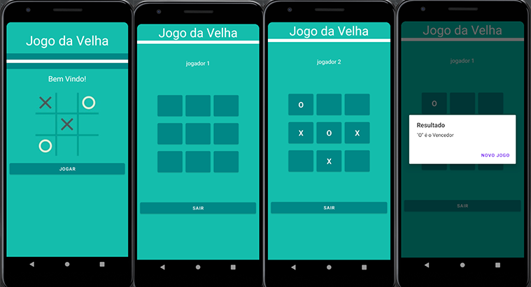

<h1 align="center">
 
  "Jogo da Velha" made in java.
</h1>

The object of the game is to make a sequence of three identical symbols, either in a vertical, horizontal or diagonal line, while trying to prevent your opponent from doing the same; When one of the participants makes a line, he wins the game; It starts from the beginning, usually swapping the chosen symbols.

  

[//]: # (Add your gifs/images here:)

  

## Built with
[//]: # (Add the features of your project here:)

-  Java

## License

This project is licensed under the MIT License - see the [LICENSE](https://opensource.org/licenses/MIT) page for details.
